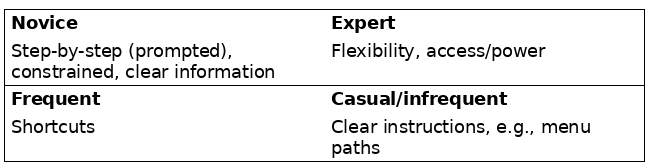
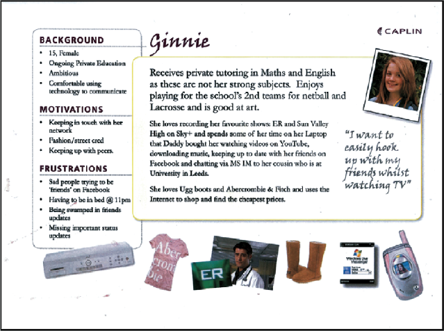
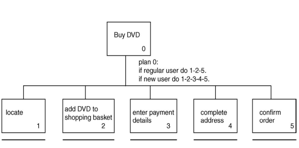
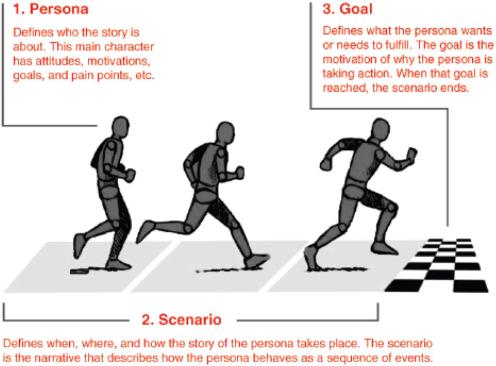
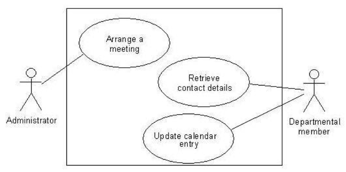
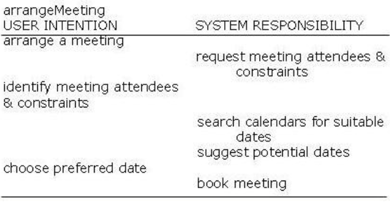

---
author: |
  | William Findlay
title: |
  | Class 3: Requirements Gathering
date: \today
bibliography: /home/housedhorse/.bibs/uni.bib
csl: /home/housedhorse/.bibs/ieee.csl
subparagraph: yes
header-includes: |
  ``` {=latex}
  \usepackage{float}
  \usepackage{listings}
  \usepackage[hang,bf]{caption}
  \usepackage{framed}
  \usepackage[section]{placeins}
  \usepackage[dvipsnames]{xcolor}

  \usepackage{pifont}

  \allowdisplaybreaks

  % fancy headers/footers
  \makeatletter
  \usepackage{fancyhdr}
  \lhead{\@author}
  \chead{}
  \rhead{\@title}
  \lfoot{}
  \cfoot{\thepage}
  \rfoot{}
  \renewcommand{\headrulewidth}{0.4pt}

  \usepackage{amsmath, amsfonts,amssymb, amsthm}
  \usepackage{siunitx}
  \usepackage[boxruled,lined,linesnumbered,titlenumbered]{algorithm2e}

  \usepackage{setspace}
  \usepackage{changepage}
  \usepackage[explicit]{titlesec}
  \usepackage{aliascnt}

  \floatplacement{figure}{!htbp}
  \floatplacement{table}{!htbp}
  \floatplacement{listing}{!htbp}
  \lstset{numbers=left,breaklines=true,frame=single,language=Python,captionpos=b,abovecaptionskip={\abovecaptionskip},
  belowcaptionskip={\belowcaptionskip},aboveskip=\intextsep,showstringspaces=false,identifierstyle=\color{Blue},
  commentstyle={\color{OliveGreen}},keywordstyle={\bfseries\color{Orange}}}
  \setlength{\captionmargin}{1in}

  \newgeometry{margin=1in}

  \newtheoremstyle{plain}
  {12pt}   % ABOVESPACE
  {12pt}   % BELOWSPACE
  {\itshape}  % BODYFONT
  {0pt}       % INDENT (empty value is the same as 0pt)
  {\bfseries} % HEADFONT
  {.}         % HEADPUNCT
  {5pt plus 1pt minus 1pt} % HEADSPACE
  {}          % CUSTOM-HEAD-SPEC

  \newtheoremstyle{definition}
  {12pt}   % ABOVESPACE
  {12pt}   % BELOWSPACE
  {\normalfont}  % BODYFONT
  {0pt}       % INDENT (empty value is the same as 0pt)
  {\bfseries} % HEADFONT
  {.}         % HEADPUNCT
  {5pt plus 1pt minus 1pt} % HEADSPACE
  {}          % CUSTOM-HEAD-SPEC

  \newtheoremstyle{remark}
  {12pt}   % ABOVESPACE
  {12pt}   % BELOWSPACE
  {\normalfont}  % BODYFONT
  {0pt}       % INDENT (empty value is the same as 0pt)
  {\itshape} % HEADFONT
  {.}         % HEADPUNCT
  {5pt plus 1pt minus 1pt} % HEADSPACE
  {}          % CUSTOM-HEAD-SPEC

  \theoremstyle{plain}

  % define theorem
  \newtheorem{theorem}{Theorem}[section]
  \providecommand*{\theoremautorefname}{Theorem}

  % define lemma
  \newtheorem{lemma}{Lemma}[section]
  \providecommand*{\lemmaautorefname}{Lemma}

  % define claim
  \newtheorem{claim}{Claim}[section]
  \providecommand*{\claimautorefname}{Claim}

  % define corollary
  \newtheorem{corollary}{Corollary}[section]
  \providecommand*{\corollaryautorefname}{Corollary}

  % define proposition
  \newtheorem{proposition}{Proposition}[section]
  \providecommand*{\propositionautorefname}{Proposition}

  % define conjecture
  \newtheorem{conjecture}{Conjecture}[section]
  \providecommand*{\conjectureautorefname}{Conjecture}

  \theoremstyle{remark}

  % define observation
  \newtheorem{observation}{Observation}[section]
  \providecommand*{\observationautorefname}{Observation}

  % define remark
  \newtheorem{remark}{Remark}[section]
  \providecommand*{\remarkautorefname}{Remark}

  \theoremstyle{definition}

  % define example
  \newtheorem{example}{Example}[section]
  \providecommand*{\exampleautorefname}{Example}

  % define definition
  \newtheorem{definition}{Definition}[section]
  \providecommand*{\definitionautorefname}{Definition}

  \newcommand{\blackbox}{\hfill$\blacksquare$}
  \usepackage{tikz}
  \newcommand*\circled[1]{\tikz[baseline=(char.base)]{
              \node[shape=circle,draw,inner sep=2pt] (char) {#1};}}

  \renewcommand{\labelitemi}{\large$\bullet$}
  \renewcommand{\labelitemii}{\ding{226}}
  \renewcommand{\labelitemiii}{\tiny$\blacksquare$}
  \renewcommand{\labelitemiv}{\small$\triangleright$}

  \titleformat{\paragraph}
  {\itshape}
  {}
  {0em}
  {\underline{#1}}[ ]
  \titleformat{\subparagraph}
  {\itshape}
  {}
  {0em}
  {#1}[ ]

  \let\lil\lstinputlisting
  \usepackage{afterpage}
  \usepackage{xcolor}
  \hypersetup{colorlinks, allcolors=., urlcolor=blue}

  \usepackage{etoolbox}% http://ctan.org/pkg/etoolbox
  \makeatletter
  \patchcmd{\lst@GLI@}% <command>
    {\def\lst@firstline{#1\relax}}% <search>
    {\def\lst@firstline{#1\relax}\def\lst@firstnumber{#1\relax}}% <replace>
    {\typeout{listings firstnumber=firstline}}% <success>
    {\typeout{listings firstnumber not set}}% <failure>
  \makeatother

  \usepackage{chngcntr}
  \counterwithin{figure}{section}
  ```
output:
  pdf_document:
    number_sections: true
    fig_crop: true
    fig_caption: true
    keep_tex: false
---
\counterwithin{lstlisting}{section}
\newpage
\pagestyle{plain}
\tableofcontents
\newpage
\pagestyle{fancy}

# Requirements

- what does the user want?
  - users
  - tasks
  - context
    - environment
    - business constraints
- share requirements with stakeholders
- create a common understanding for the team
- work in progress
  - clarification
  - refining
  - re-scoping

# Users

## Who Are They?
- abilities
- background
- attitudes towards computers
- experience with the system
  - see \autoref{user-types}



## Personas
- predict someone's behavior by
  - **understanding their mental state**
- capture **user characteristics**
  - not real people
  - **synthesized** from **real characteristics**
- bring them to life
  - name
  - goal
  - background
- always develop **multiple personas**
- see \autoref{personas}



\FloatBarrier

### How to Create

- types of users
  - primary
    - frequent
    - hands on
  - secondary
    - occasional
    - through someone else
  - tertiary
    - affected by the product
      - doesn't use directly

\begin{lstlisting}[caption={Algorithm to create a persona.}]
determine usertypes

for usertype in usertypes:
  """
  data about:
              - goals
              - tasks
              - context
  """
  collect_data(usertype)

  # create a use profile
  create_user_profile(usertype)

for profile in profiles:
  # turn the profile into a believable character
  add_details(profile)
\end{lstlisting}

### Problems

- characters not believable
  - not based on data
  - no clear relationship to data
- not communicated well
  - resume-like posters
- no understanding of **how to use** characters
  - must be applicable to **all stages** of development cycle
- little high-level support

# Data Gathering for Requirements

## Data Gathering Techniques 
1. documentation
1. contextual inquiry
1. observation
   - direct
   - indirect
1. interviews
1. questionnaires
1. research similar products
   - good for prompting requirements

### Documentation
- study existing documentation
  - procedures, rules
  - regulations
    - business constraints
  - steps involved in activity
- don't use only documentation
  - use another technique too
- **no stakeholder time**

### Contextual Inquiry
- ethnographic study
  - user is the expert
  - designer is apprentice
- interview with user
  - at user's workstation
  - 2-3 hours long
- four principles
  - context
  - partnership
  - interpretation
  - focus

### Observation
- direct
  - observe stakeholders' tasks
  - understand nature and context of the tasks
  - lots of time spent by design team
  - lots of data
- indirect
  - not often used
  - good for logging tasks

### Interviews
- good for exploring issues
  - great for the beginning
- time consuming
  - possibly to the point of being unfeasible
- props to elicit responses
- focus groups
  - group interview
  - get a consensus or highlight conflict
  - some individuals may dominate the group

### Questionnaires
- often used with other techniques
- quantitative **or** qualitative data
- good for large groups answering specific questions

## Problems
- availability of **real users** for study
  - especially in specialized populations
- communication
  - different discourse communities
- domain knowledge implicit
  - knowledge articulation
    - describe how you walk or breathe
    - difficult to do
- balancing functionality and usability
- economic/business changes

## Guidelines
- use a combination of techniques
- use props when possible
- involve all stakeholder groups
- run a pilot session with friends/family
- think about how to record data
- sensible compromises in data collection/analysis

# Task Descriptions

- task descriptions
  - envision **new** systems/devices
  - scenarios
  - use cases
- task analysis
  - investigate an **existing** situation/system
  - most popular: **hierarchical task analysis**

## Hierarchical Task Analysis

- steps
  1. start with a goal and identify main tasks
  1. recursively break each task down into subtasks
  1. group as plans
     - how to perform the task in practice?
- physical and observable actions
  - including actions not related to software

### HTA Example

See \autoref{hta} for a graphical example.

0. in order to buy a DVD
0. locate DVD
0. add DVD to shopping cart
0. enter payment details
0. complete address
0. confirm order

- new user: 1 2 3 4 5
- regular user 1 2 5 (skip 3 and 4)



## Scenarios

- concise description or story
  - someone using a product to achieve a goal
  - setting
  - situation state
  - actors
    - motivations
    - knowledge
    - capabilities
  - tools/objects
- stakeholders participate in definition
  - use their language
- create shared understanding for design team
- goal oriented, focus on needs of users
- encourage reflection, raise questions



\FloatBarrier

## Use Cases
- related sequences of transactions
  - in a dialog with the system
- system **interacts with** actors
- initiated by **actor** or **system event**
- helps elicit functional requirements
  - good for development/testing



1. The user chooses the option to arrange a meeting.
1. The system prompts user for the names of attendees.
1. The user types in a list of names.
1. The system checks that the list is valid.
   - if the list of people is invalid
     - display error
     - return to step 2
1. The system prompts the user for meeting constraints.
1. The user types in meeting constraints.
1. The system searches the calendars for a date that satisfies the constraints.
1. The system displays a list of potential dates.
   - if no potential dates found
     - display a message
     - return to step 5
1. The user chooses one of the dates.
1. The system writes the meeting into the calendar.
1. The system emails all the meeting participants informing  them of them appointment

## Essential Use Cases (Task Cases)
- simplified, generalized use case
  - one complete and useful interaction with a system
  - understood from the perspective of users
- technology free
- identifies
  - user intentions
  - system responsibilities
- used for UI development

### How It Works

- user intentions
  - what user does and why
- system responsibility
  - obligations of the system
  - **what** needs to be done, **not how**


