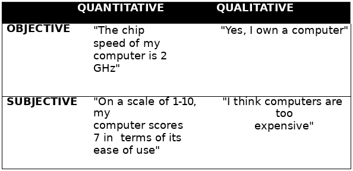
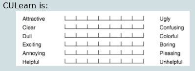

---
author: |
  | William Findlay
title: |
  | Section 4: Data Gathering
date: \today
bibliography: /home/housedhorse/.bibs/uni.bib
csl: /home/housedhorse/.bibs/ieee.csl
subparagraph: yes
header-includes: |
  ``` {=latex}
  \usepackage{float}
  \usepackage{listings}
  \usepackage[hang,bf]{caption}
  \usepackage{framed}
  \usepackage[section]{placeins}
  \usepackage[dvipsnames]{xcolor}

  \usepackage{pifont}

  \allowdisplaybreaks

  % fancy headers/footers
  \makeatletter
  \usepackage{fancyhdr}
  \lhead{\@author}
  \chead{}
  \rhead{\@title}
  \lfoot{}
  \cfoot{\thepage}
  \rfoot{}
  \renewcommand{\headrulewidth}{0.4pt}

  \usepackage{amsmath, amsfonts,amssymb, amsthm}
  \usepackage{siunitx}
  \usepackage[boxruled,lined,linesnumbered,titlenumbered]{algorithm2e}

  \usepackage{setspace}
  \usepackage{changepage}
  \usepackage[explicit]{titlesec}
  \usepackage{aliascnt}

  \floatplacement{figure}{!htbp}
  \floatplacement{table}{!htbp}
  \floatplacement{listing}{!htbp}
  \lstset{numbers=left,breaklines=true,frame=single,language=Python,captionpos=b,abovecaptionskip={\abovecaptionskip},
  belowcaptionskip={\belowcaptionskip},aboveskip=\intextsep,showstringspaces=false,identifierstyle=\color{Blue},
  commentstyle={\color{OliveGreen}},keywordstyle={\bfseries\color{Orange}}}
  \setlength{\captionmargin}{1in}

  \newgeometry{margin=1in}

  \newtheoremstyle{plain}
  {12pt}   % ABOVESPACE
  {12pt}   % BELOWSPACE
  {\itshape}  % BODYFONT
  {0pt}       % INDENT (empty value is the same as 0pt)
  {\bfseries} % HEADFONT
  {.}         % HEADPUNCT
  {5pt plus 1pt minus 1pt} % HEADSPACE
  {}          % CUSTOM-HEAD-SPEC

  \newtheoremstyle{definition}
  {12pt}   % ABOVESPACE
  {12pt}   % BELOWSPACE
  {\normalfont}  % BODYFONT
  {0pt}       % INDENT (empty value is the same as 0pt)
  {\bfseries} % HEADFONT
  {.}         % HEADPUNCT
  {5pt plus 1pt minus 1pt} % HEADSPACE
  {}          % CUSTOM-HEAD-SPEC

  \newtheoremstyle{remark}
  {12pt}   % ABOVESPACE
  {12pt}   % BELOWSPACE
  {\normalfont}  % BODYFONT
  {0pt}       % INDENT (empty value is the same as 0pt)
  {\itshape} % HEADFONT
  {.}         % HEADPUNCT
  {5pt plus 1pt minus 1pt} % HEADSPACE
  {}          % CUSTOM-HEAD-SPEC

  \theoremstyle{plain}

  % define theorem
  \newtheorem{theorem}{Theorem}[section]
  \providecommand*{\theoremautorefname}{Theorem}

  % define lemma
  \newtheorem{lemma}{Lemma}[section]
  \providecommand*{\lemmaautorefname}{Lemma}

  % define claim
  \newtheorem{claim}{Claim}[section]
  \providecommand*{\claimautorefname}{Claim}

  % define corollary
  \newtheorem{corollary}{Corollary}[section]
  \providecommand*{\corollaryautorefname}{Corollary}

  % define proposition
  \newtheorem{proposition}{Proposition}[section]
  \providecommand*{\propositionautorefname}{Proposition}

  % define conjecture
  \newtheorem{conjecture}{Conjecture}[section]
  \providecommand*{\conjectureautorefname}{Conjecture}

  \theoremstyle{remark}

  % define observation
  \newtheorem{observation}{Observation}[section]
  \providecommand*{\observationautorefname}{Observation}

  % define remark
  \newtheorem{remark}{Remark}[section]
  \providecommand*{\remarkautorefname}{Remark}

  \theoremstyle{definition}

  % define example
  \newtheorem{example}{Example}[section]
  \providecommand*{\exampleautorefname}{Example}

  % define definition
  \newtheorem{definition}{Definition}[section]
  \providecommand*{\definitionautorefname}{Definition}

  \newcommand{\blackbox}{\hfill$\blacksquare$}
  \usepackage{tikz}
  \newcommand*\circled[1]{\tikz[baseline=(char.base)]{
              \node[shape=circle,draw,inner sep=2pt] (char) {#1};}}

  \renewcommand{\labelitemi}{\large$\bullet$}
  \renewcommand{\labelitemii}{\ding{226}}
  \renewcommand{\labelitemiii}{\tiny$\blacksquare$}
  \renewcommand{\labelitemiv}{\small$\triangleright$}

  \titleformat{\paragraph} % command to change
  [runin]                  % shape  (runin, etc.)
  {\small\bfseries}              % format (bfseries, itshape, etc.)
  {}                       % label  (thesection, thesubsection, etc.)
  {0em}                    % separation between label and body
  {#1}        % before the body
  []                       % after the body

  \titleformat{\subparagraph} % command to change
  [runin]                  % shape  (runin, etc.)
  {\small\bfseries}              % format (bfseries, itshape, etc.)
  {}                       % label  (thesection, thesubsection, etc.)
  {0em}                    % separation between label and body
  {#1}        % before the body
  []                       % after the body

  \let\lil\lstinputlisting
  \usepackage{afterpage}
  \usepackage{xcolor}
  \hypersetup{colorlinks, allcolors=., urlcolor=blue}

  \usepackage{etoolbox}% http://ctan.org/pkg/etoolbox
  \makeatletter
  \patchcmd{\lst@GLI@}% <command>
    {\def\lst@firstline{#1\relax}}% <search>
    {\def\lst@firstline{#1\relax}\def\lst@firstnumber{#1\relax}}% <replace>
    {\typeout{listings firstnumber=firstline}}% <success>
    {\typeout{listings firstnumber not set}}% <failure>
  \makeatother

  \usepackage{chngcntr}
  \counterwithin{figure}{section}
  ```
output:
  pdf_document:
    number_sections: true
    fig_crop: true
    fig_caption: true
    keep_tex: false
---
\counterwithin{lstlisting}{section}
\newpage
\pagestyle{plain}
\tableofcontents
\newpage
\pagestyle{fancy}

# Types of Data

## Qualitative
- descriptions
- observable
  - not measurable
  - open-ended
- you can **assign** values to qualitative data
  - but this is **still not quantitative**

## Quantitative
- numbers
  - measurable
- test specific characteristics
  - hypothesis testing

## Objective
- external measure
  - facts
  - precise measurement

## Subjective
- **not** from external measure
  - personal opinion
  - personal judgement




# Collection Methods

## Questionnaires
- good for
  - requirements research
  - measure usability
- questions can be
  - open
    - easy to analyze
  - closed
    - unrestricted
    - less bias
- supports large populations
- many media
  - paper
  - email
  - web
  - etc.

### Problems?
- order of questions can create bias
- different versions for different populations?
- need **clear instructions**
- questionnaire design
  - need whitespace
  - should also be compact enough
  - graphic design matters
- wording is important
  - phrases positive, negative, mixed

### Question Types
1. single answer checkboxes/radio buttons
1. multi-option checkboxes
1. rating scales
   - Likert (ordinal) scale
   - semantic scale
1. ranking questions
1. open-ended
1. conditional sub-questionnaires

#### Single/Multi Answer Multiple Choice
- be specific
  - "1-3 times" vs "rarely"
- cover all possibilities
  - **no overlap**
- categorical stats

#### Likert (Ordinal) Scale
- measures
  - opinions
  - beliefs
  - likes/dislikes
- posit claim
  - ask about agreement
- usually 3-10 choices
  - odd number allows neutrality
  - even number forces a choice
- anchored with labels
  - at least endpoints
  - sometimes each option
- problems
  - open to user interpretation
  - user can distort distance between choices
  - acquiescence bias
    - reverse half the questions to avoid this

{width=60%}

#### Semantic Scale
- measures
  - opinions
  - beliefs
- two opposing poles
  - explore a range of attitudes ranging from
    - one pole
    - to the other
- each pole is assigned an adjective for an attitude

{width=60%}

#### Ranked Questions
- rank choices in a list
  - forces user to choose
  - indicates preferences

#### Open-Ended Questions
- users give opinions
- unconstrained
  - hard to tabulate
  - time consuming
    - to fill in
    - to evaluate

### Guidelines
- clear language
- no leading questions
- equal weight to multiple choice answers
- no double negative questions
- no double barreled questions
  - two questions in one
- no embarrassing questions
- design with a clear purpose
- keep it short
- use as a secondary source
- test questions and validity
- test analysis
- is there an existing questionnaire for the same thing?
- consider privacy/security

## Observation

### Simple Observation
- evaluator watches user complete a task
  - no insight into user's decision making
  - no insight into user's attitude

### Think-Aloud Observation
- participants say out loud what they are
  - thinking
  - doing
- problems?
  - awkward for subject
  - may alter the way they perform the task
  - hard to talk and concentrate

### Co-Discovery Observation
- two people work together on a task
  - record conversation
  - think-aloud awkwardness is more natural
  - thinking process of both users

## Interviews

### Types of Interviews
- unstructured
  - not directed by script
  - rich
  - not replicable
- structured
  - scripted, similar to questionnaire
    - why not just do a questionnaire (questionnaires are cheaper)?
  - lacks richness
  - replicable
- semi-structured
  - guided by a script
  - ideas can still be explored in depth
  - good balance between
    - richness
    - replicability

### Types of Questions
- closed
  - how many times a week do you buy coffee at this store?
- open
  - how does buying coffee here compare to other places?

### Interview Format

#### Pre-Interview
- prepare/read consent form
- prepare script
- determine team roles and note-taking
- schedule participant

#### Interview
- participant read/sign consent form
- conduct interview
- thank participant

#### Post-Interview
- debrief with team
  - write down
    - impressions
    - thoughts
  - edit notes
- take care of notes and consent forms

#### Script
- start
  - introduce study and purpose
  - small talk to make person feel at ease
  - set expected time
  - answer admin questions
- get participant background
- cover remaining issues in script
- finish with easy questions
  - non-controversial
- wrap up, debrief

### Guidelines
- make participant feel at ease
- allow flexibility
- practice first
- pick representative users
- avoid bias
- natural setting
- participant should do 80% of the talking
- probe/prompt without leading
- keep an eye on the time

### Group Interviews (Focus Groups)
- 2-10 people
- structured or unstructured
  - usually at least an agenda
- skilled moderator important
- audio/video recorded

#### Advantages
- diverse and sensitive issues
- social context
  - could also be a disadvantage
    - unpopular opinions less likely to be expressed?
- helps locate good participants for further study

#### Disadvantages
- some interviewees dominate
- expensive

### Retrospective (Post-Task) Interview
- interview after completing a task
  - find out how it went
  - where did things go wrong?
  - what happened?

#### Advantages
- good for followup
- users offer concrete suggestions

#### Disadvantages
- takes time
- second session?
