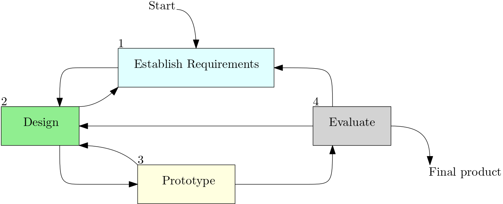
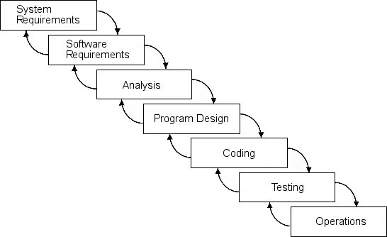
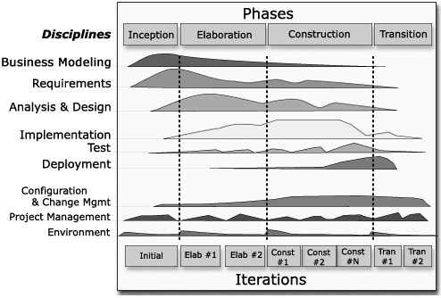

\newpage
\pagestyle{plain}
\tableofcontents
\newpage
\pagestyle{fancy}

# Good Design and User Experience (UX)

## What is User Experience?
- how a product **behaves** when **used in the real world**
  - how do people **feel** about it
  - **every** product used by someone has a UX
    - even ketchup bottles
- we **can't design a user experience**
  - we have to design **for** the user experience

## How Do We Design for a Good User Experience?
- we must take into account:
  - **who** are our users?
  - **what** tasks are they trying to accomplish?
  - **where** is the interaction taking place?

## Usability Goals
1. effectiveness
   - effective to use
1. efficiency
   - efficient to use
1. safety
   - safe to use
1. utility
   - does it do what it's supposed to do?
1. learnability
   - is it easy to learn how to use?
1. memorability
   - is it easy to remember how to use it?

### Example: Password Scheme
1. effectiveness
   - number of errors permitted
1. efficiency
   - entry time should take 5-10 seconds
1. safety
   - secure from brute-force and shoulder surfing attacks
1. utility
   - password can be used in basic computer applications
1. learnability
   - use should learn how to use the password scheme in 5 minutes or less
1. memorability
   - password recall should take less than 5 seconds

## Understand User's Needs
- consider what people are **good and bad** at
- how do people **currently** do things?
  - how can we improve it?
- listen to what people want?
  - not always easy to find out
  - ask **the right questions**
- tried and tested **user-centered** methods

## Design Principles
1. visibility
   - show the **state** of the system
   - show **possible actions**
1. affordance
   - **suggest** consequences of actions
1. constraints
   - **steer** actions
1. consistency
   - establish **similarities** between analogous parts of the UI
1. feedback
   - **show** consequences of actions

### Visibility
- show the current state to the user
- show **all possible options** to the user
- **make it clear** what they need to do

### Affordance
- **actions suggested** by the **design** of an object
- **actual** affordance
  - on actual objects
- **perceived** affordance
- how do we represent the actual in the virtual world?
- problems:
  - **false affordance**
    - perceived affordance does not match what the user was intended to do
  - when **simple things** need to be **explained**

### Constraints
- **opposite** of **affordance**
- **limit** perceived **potential actions** based on the object's appearance
- **physical** constraints
  - a large peg doesn't fit in a small hole
- **cultural** constraints
  - red is bad
  - green is good
- **logical** constraints
  - what should **probably** happen

### Consistency
- for **analogous elements**
  - analogous operation
  - analogous design
- **easily** learn new UIs
- **less consistency** $\implies$ **more burden** on users

### Feedback
- **communicate** to the user what has been done
  - successful?
  - unsuccessful?
  - results?
- types
  - auditory
  - visual
  - haptic/tactile
  - combination
- type to choose depends on **context**

# Design Process

## Involve Users

### Authenticity
- users have **domain expertise**
  - what are their common tasks?
  - exceptions?
  - what are the **roles** in the domain?
- we need their **perspective**

### Pragmatics
- expectation management
  - realistic expectations
    - no surprises
    - no disappointments
  - training
  - communication
- ownership
  - make users **active stakeholders**

## Degrees of User Involvement
- member of the **design team**
  - full time
  - part time
  - short term
  - long term
- dissemination devices
  - **social media**
  - increase outreach
  - two-way communication
- post-release
- **combination** of these approaches

## User-Centered Approach
- **early focus** on **users** and **their tasks**
  - **study** characteristics
    - cognitive
    - behavioral
    - anthropomorphic
    - attitudinal
- empirical measurements
  - reactions
  - performance
- **iterative design**

## Four Main Activities of Interaction Design

\FloatBarrier

## Who are the Users/Stakeholders
- not as obvious as you think
  - there might be other users besides who you initially think
- those who:
  - interact directly with product
  - manage direct users
  - receive output from product
  - make the purchasing decision
  - use competitors' products
- **three categories**
  - primary
    - frequent hands-on
  - secondary
    - occasional
    - or through someone else
  - tertiary
    - affected by the product's introduction
    - will influence the product's purchase
    - e.g., customers at a store where a new cash system is introduced

## User Needs
- users don't always know **what is possible**
- they can't always **tell you** what they need
  - we need to **ask the right questions**
  - we need to **conduct studies**
- look at **existing tasks**
  - context
  - information they require
  - who collaborates?
  - why is the current method used?
    - what might be wrong with it?
- consider **envisioned tasks**
  - what might they want to do?
    - why can't they currently do it?

## ISO 9241-210 Human Centered Design for Interactive Systems
1. The design is based on an **explicit understanding of:**
   - users
   - tasks
   - environments
1. Users are involved throughout
   - design
   - development
1. Design is driven by and influenced by **user-centered** evaluation
1. Design process is **iterative**
1. The design addresses the **whole UX**
1. The design team includes **multi-disciplinary skills and perspectives**

\newpage

# Interaction Design vs Traditional Software Engineering

## Integration of ID with SE Models

### Royce Waterfall
- not great
- **not iterative**

{width=60%}

\FloatBarrier

### Rational Unified Process

{width=60%}

\FloatBarrier

### Agile

- this is a great candidate for ID
  - iteration-focused model

\FloatBarrier

## Integration with Other Models
- **start** with some **early developer involvement**
- **continue** with designer involvement **during implementation**

### Early Developer Involvement
- developers can help determine **viable solutions**
  - avoid technical limitations
- help with knowledge transfer
  - relate to client

### Continued Designer Involvement
- design reviews
- verify deliverables for good design
- design coach
- limit refactoring as a result of bad UI implementation
